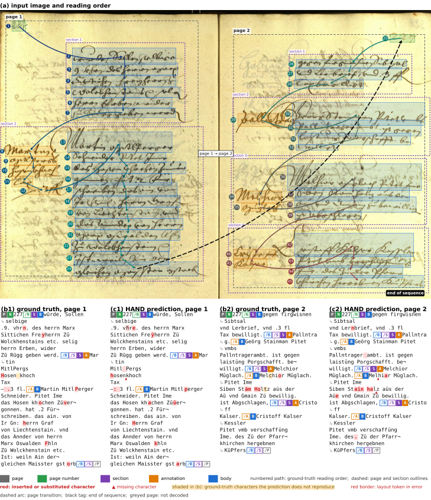
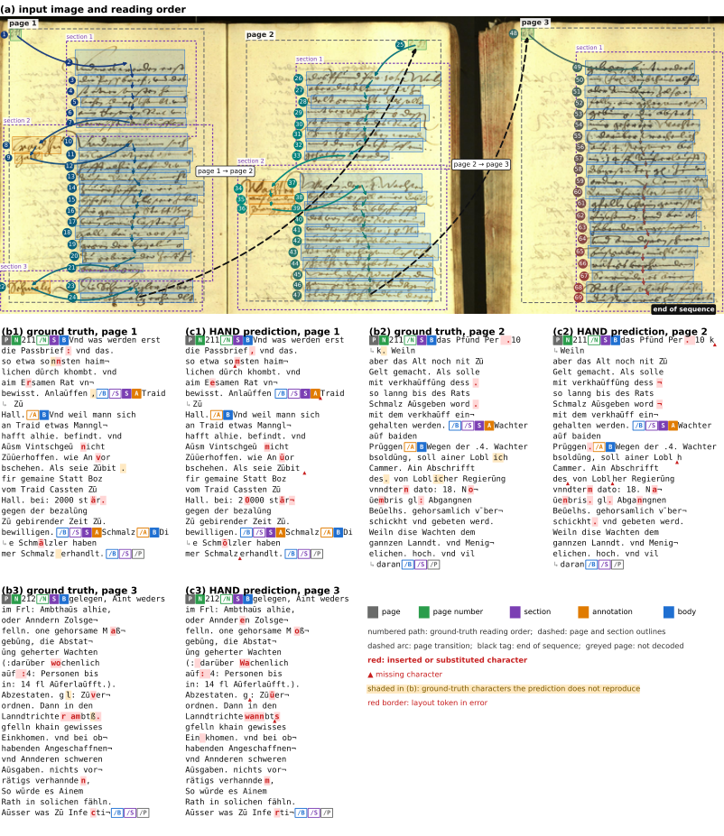
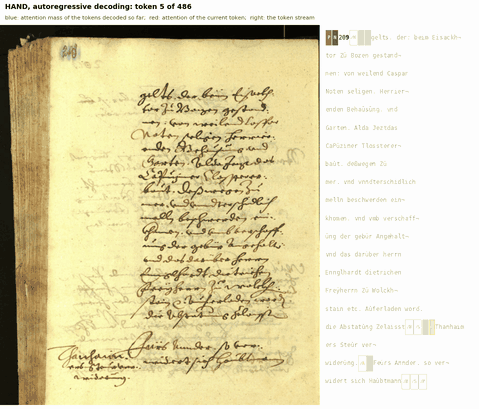
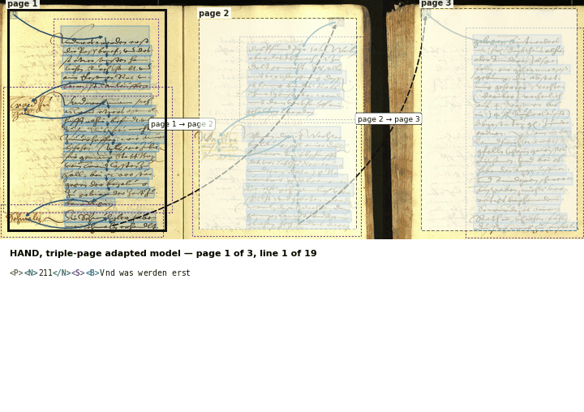

# HAND-Decoding

Code and evidence for **HAND: Unified Text–Layout Decoding for Handwritten
Document Recognition** (Hamdan, Rahiche, Cheriet). HAND is a segmentation-free encoder–decoder
model that reads a handwritten document image as one autoregressive sequence of interleaved
characters and layout tokens in reading order, so that transcription and document structure are
predicted under a single objective. The repository contains the model, training and evaluation
code, the run records behind every reported number, the trained READ 2016 weights and a Gradio
demo. The manuscript is under review and is not included; no dataset is redistributed.

## Overview

HAND follows the interleaved text–layout formulation of DAN and keeps its architecture, parameter
count and training recipe, so that it can be compared with the public DAN weights under an
identical protocol. On top of that reference it studies two inference-cost mechanisms and how the
formulation behaves as the input grows from one page to two and three pages.

On the 50 READ 2016 single test pages HAND and DAN differ by +0.138 pp CER (95 % CI
[−0.188, +0.493], *p* = 0.42), smaller than the 0.70 pp between-seed spread on this split; the
two systems are statistically indistinguishable.

## Key ideas

- **Joint text–layout decoding.** Characters and layout tokens (page, page number, section, body,
  annotation) form one output stream, supervised by one cross-entropy; there is no segmentation
  stage.
- **Shared visual key/value projection.** One projection of the visual memory serves all eight
  decoder layers, removing 921,088 parameters (7,033,700 → 6,112,612, −13.1 %) at unchanged
  validation CER (4.41 % vs 4.41 %, paired *p* = 0.997). The saving is in stored weights, not
  latency.
- **Speculative decoding with draft heads.** Four lightweight heads on a frozen decoder propose
  future symbols that the decoder verifies in one pass. Exact with respect to greedy decoding in
  exact arithmetic; 2.73× to 2.947× lower latency.
- **Single-, double- and triple-page study.** The page model reads exactly one page of a larger
  image; brief continued training on multi-page images restores recognition accuracy to the
  single-page range.

## Architecture

<p align="center">
  
</p>

The evaluated system is `FCN_Encoder` + `GlobalHTADecoder` in
[`hand/models/baseline/`](hand/models/baseline/), optionally with `--share-memory-kv` and the draft
heads of [`spec_heads.py`](hand/models/baseline/spec_heads.py). The figure is drawn from
[`docs/assets/hand_architecture.tex`](docs/assets/hand_architecture.tex).

## Results

All values are taken from the manuscript. Greedy decoding, batch size 1, cached visual keys and
values, mixed precision.

**READ 2016 single pages (test, 50 pages).** CER and WER in percent.

| Method | CER | WER | LOER ↓ | mAP-CER ↑ |
|---|---:|---:|---:|---:|
| DAN, public weights, our evaluation | **3.41** | 13.05 | 0.0517 | 0.9326 |
| HAND, our evaluation | 3.55 | 13.31 | 0.0529 | 0.9264 |
| Faster-DAN, published | 3.95 | 14.06 | 0.0382 | 0.9420 |
| DANCER, published | 3.36 | 13.73 | 0.0337 | 0.9473 |
| DANIEL, published | 4.03 | 15.63 | 0.0337 | 0.9266 |

**Inference efficiency (READ 2016 test, 50 pages).** Speed-ups are ratios of latencies measured
in the same session; error rates are comparable only within a training-duration group.

| Configuration | Training samples | Parameters | Speed-up | CER | Identical to greedy |
|---|---:|---:|---:|---:|:-:|
| HAND + speculative (*m* = 5) | 1,258,600 | 7,399,668 | 2.73× | 3.55 | 50 of 50 |
| HAND + shared K/V | 500,000 | 6,112,612 | 1.01× | 4.00 | – |
| HAND + shared K/V + speculative, mixed precision | 500,000 | 6,478,580 | 2.886× | 4.00 | 48 of 50 |
| HAND + shared K/V + speculative, single precision | 500,000 | 6,478,580 | 2.947× | 4.00 | 50 of 50 |

Ablations and negative results: [`docs/ablations.md`](docs/ablations.md).

## Multi-page recognition

| Model | Scale | *n* | CER | WER | LOER ↓ | Latency (s) | Peak memory (GB) |
|---|---|---:|---:|---:|---:|---:|---:|
| Page model, no adaptation | Single page | 50 | 3.55 | 13.28 | 0.0529 | 2.12 | 1.20 |
| Page model, no adaptation | Double page | 24 | 54.4 | 58.8 | 0.4425 | 2.12 | 1.86 |
| Page model, no adaptation | Triple page | 16 | 68.7 | 72.3 | 0.6019 | 2.43 | 2.52 |
| Double-page adapted | Double page | 24 | **3.60** | **13.27** | 0.0474 | 4.70 | 1.86 |
| Triple-page adapted | Triple page | 16 | **3.48** | **13.41** | 0.0470 | 6.84 | 2.52 |
| DAN, published, double-page trained | Double page | 24 | 3.70 | 14.15 | 0.0498 | – | – |

Without adaptation the page model reads the first page and stops: the architecture represents the
longer input, but the stopping behavior is learned from single pages. Continued training on
multi-page images (311 epochs for double pages, a further 66 for triple pages) restores accuracy
to the single-page range; each adapted model then over-generates on inputs shorter than those it
was trained on. Decoding cost grows mainly with the output length, while the larger visual memory
adds memory and a smaller scale-dependent overhead. No published system reports triple-page
results. Commands and per-image results: [`experiments/multipage/`](experiments/multipage/).

<p align="center">
  
</p>

<p align="center">
  
</p>

## Cross-dataset evaluation

Separate models, each trained on its own corpus with the same architecture and procedure; the
output vocabulary is set to the corpus character set. CER and WER in percent.

| Dataset | Val. CER | Test CER | Test WER |
|---|---:|---:|---:|
| READ 2016 (historical German, Latin script, page level) | 3.95 | 3.55 | 13.31 |
| IAM (modern English, Latin script, page level) | 4.92 | 6.34 | 17.62 |
| KHATT (modern Arabic, Arabic script, paragraph level) | 16.62 | 21.89 | 30.87 |

The rows are not a cross-corpus ranking. KHATT elicits one fixed passage from many writers, so
89.2 % of its test character 20-grams occur in the training text; that row measures transfer
across script and writers, not recognition of unseen text. Layout is evaluated on READ 2016 only.

## Qualitative results

The manuscript and supplementary contain the representative examples. Further examples that are
not in the PDFs (additional single pages, the triple-page failure without adaptation, a
before/after adaptation comparison) are in [`docs/gallery/`](docs/gallery/). Every displayed
prediction is read from the stored result files; none is decoded or edited for display.

## Animated demonstrations

All three animations are rendered from stored predictions; nothing is decoded for display.

**Autoregressive decoding.** READ 2016 test page 11, decoded symbol by symbol and seen through
the decoder's last-layer cross-attention: blue is the attention accumulated so far, red the
current symbol. The decoder follows the reading order of the label scheme without any explicit
line detection.

<p align="center">
  
  <br/>
  <sub>Static version: <a href="docs/assets/decoding_test_11.png">decoding_test_11.png</a></sub>
</p>

**Speculative decoding.** The same page with four draft heads (*m* = 5). Each verification pass
shows the drafted symbols, then the check: accepted (green), the first rejected draft replaced
by the base model's symbol (red), discarded drafts (grey), and the base model's extra symbol
after a fully accepted draft (blue). The page takes 156 passes for 486 symbols, and the output
is identical to greedy decoding; the stored log covers the first 40 passes.

<p align="center">
  
  <br/>
  <sub>Static version: <a href="docs/assets/decoding_test_11_speculative.png">decoding_test_11_speculative.png</a></sub>
</p>

**Triple-page decoding.** The triple-page adapted model's output on test image `test_5`,
revealed two lines at a time with layout tokens as tags. The image shows the reference regions;
the page being transcribed is outlined and pages not yet reached are dimmed. Per-line attention
was not logged for this decode, so the animation shows the order of the output, not where the
model attended.

<p align="center">
  
  <br/>
  <sub>Static version: <a href="docs/assets/qualitative_triple_page.png">qualitative_triple_page.png</a></sub>
</p>

Regenerate with [`tools/decoding_animation.py`](tools/decoding_animation.py) and
[`tools/gallery_animations.py`](tools/gallery_animations.py); more examples are in
[`docs/gallery/`](docs/gallery/README.md).

## Installation

```bash
python -m venv .venv && source .venv/bin/activate
pip install -r requirements-pinned.txt     # the environment every number was measured in
pip install -e .
python tools/validate_install_cpu.py       # CPU only; no GPU, dataset or network needed
python -m pytest tests -q          # CPU test suite
```

`requirements-pinned.txt` is the reference environment (Python 3.11.14, PyTorch 2.9.1+cu128,
CUDA 12.8); `requirements.txt` holds loose ranges and `environment.yml` the conda equivalent.
Do not install TensorFlow alongside: a build against NumPy 1.x aborts
`import torch.utils.tensorboard`.

**Data.** No dataset is redistributed. [`data/README.md`](data/README.md) gives, per corpus, the
official source, the split used, the preparation command and the licence. READ 2016 is CC BY 4.0;
IAM and KHATT require registration with their providers.

```bash
export HAND_EXTERNAL_DATA=/path/to/your/corpora
bash scripts/setup_dataset_links.sh          # data/ symlinks
bash scripts/setup_dan_fonts.sh              # the 41 synthetic-curriculum fonts
python scripts/verify_dan_fonts.py
```

**Model weights.** The four READ 2016 models are attached to the
[v1.1.0 release](https://github.com/DocumentRecognitionModels/HAND-Decoding/releases/tag/v1.1.0)
under CC BY 4.0. Before release, each was checked to reproduce the stored prediction of its
example image token for token. Download and verify one with:

```bash
cd release && python -m hand_release.hub hand-read2016-page     # -> weights/hand-read2016-page/
```

| Model | Reads | Reported result (paper) | Package | SHA-256 |
|---|---|---|---|---|
| `hand-read2016-page` | single pages | READ 2016 test CER 3.55 %, WER 13.31 % | 27.5 MB, with draft heads | `877246ec2503da82636a820d99091c9a99c234d5396b8cb8e9bc9ab8fc4f645c` |
| `hand-read2016-page-compact` | single pages | CER 4.00 %, WER 15.74 % (500,000 samples) | 27.5 MB, with draft heads | `c53984243256c9e90aee7aea887fd8706034a39cf31ddc81631251f58d6d7791` |
| `hand-read2016-double-page` | double pages | double-page test CER 3.60 %, WER 13.27 % | 27.5 MB, with draft heads | `42928757e0d561343db7a7ef7452886ef002310770ea8ffa7164361728fbe9ea` |
| `hand-read2016-triple-page` | triple pages | triple-page test CER 3.48 %, WER 13.41 % | 26.1 MB | `1c09c18ecd3aac0a99011dee05b593832b9e4a1ec818efc2779e3c742262d58d` |

Each model reads the number of pages it was trained on; see
[`docs/model_card.md`](docs/model_card.md). The IAM and KHATT models are not released: they
were trained on corpora licensed for registered research use. Training from scratch initialises
from the public READ 2016 line checkpoint of DAN (Zenodo
[10.5281/zenodo.7244382](https://doi.org/10.5281/zenodo.7244382), CC BY 4.0); place it at
`weights/dan/fcn_read_2016_line_syn.pt`.

## Demo

A Gradio app reads an uploaded image with any of the four models and shows the output stream
with layout tokens as colored tags, the plain transcription, and the parsed regions. Weights are
downloaded and verified on first use.

```bash
pip install -r demo/requirements.txt
python demo/app.py            # http://127.0.0.1:7860   (--share for a temporary public link)
```

GitHub does not run Python apps, so the demo runs locally or on any Gradio host; see
[`demo/README.md`](demo/README.md).

## Evaluation

```bash
# the page model, from an exported checkpoint
python release/tools/evaluate_release.py --model /path/to/export --split test --device cuda

# efficiency, speculative decoding, and the greedy-identity check
python tools/efficiency_bench.py --n-pages 50 --split test --out <out>.json
python tools/spec_decode.py --m 5 --split test --out <out>.json
python tools/verify_exact_decoding.py

# multi-page evaluation (without and with adaptation)
python tools/multipage_eval.py --help

# between-seed spread and paired bootstrap contrasts
python tools/seed_variance_analysis.py
```

Every reported number uses evaluation batch size 1.

## Reproducing the paper

Training needs a GPU and READ 2016; the reported page model is a two-phase run of about 89 GPU-hours
via `tools/train.py`. The exact commands and run records are in
[`docs/reproducibility.md`](docs/reproducibility.md).

| Document | Contents |
|---|---|
| [`docs/reproducibility.md`](docs/reproducibility.md) | environment, inputs, commands and expected output |
| [`docs/REPRODUCIBILITY_ARTIFACTS.md`](docs/REPRODUCIBILITY_ARTIFACTS.md) | every published artefact, its configuration and the result it supports |
| [`docs/ablations.md`](docs/ablations.md) | ablations and negative results |
| [`docs/model_card.md`](docs/model_card.md) | intended use, limitations, licence chain |
| [`experiments/`](experiments/) | run records and profiling measurements |
| [`release/MANIFEST.md`](release/MANIFEST.md) | SHA-256 of every published file |

### Repository layout

| Path | Contents |
|---|---|
| `hand/` | the library: model (`models/baseline/` is the evaluated system), dataset formatters (including the double- and triple-page builder), trainers, layout metrics |
| `tools/` | command-line entry points: `train.py` (trains the reported models), evaluation, efficiency, multi-page study, figures |
| `tests/` | CPU test suite |
| `release/` | inference package, release tools, licence notice and manifest |
| `experiments/qualitative/` | stored predictions behind every qualitative figure and animation |
| `demo/` | Gradio demo and three READ 2016 example images |
| `hand/models/experimental/` | components documented in the supplementary but used by no reported model |

## Citation

The paper is under review. Until it is published, please cite the preprint, which appeared under
an earlier title:

```bibtex
@article{hamdan2024hand,
  title   = {{HAND}: Hierarchical Attention Network for Multi-Scale Handwritten
             Document Recognition and Layout Analysis},
  author  = {Hamdan, Mohammed and Rahiche, Abderrahmane and Cheriet, Mohamed},
  journal = {arXiv preprint arXiv:2412.18981},
  year    = {2024},
  url     = {https://arxiv.org/abs/2412.18981}
}
```

Machine-readable metadata is in [`CITATION.cff`](CITATION.cff).

## License

The author's own code is released under the MIT license ([`LICENSE`](LICENSE)). The tree also
contains:

| Component | License |
|---|---|
| 27 Python files derived from DAN / VerticalAttentionOCR (Denis Coquenet) | CeCILL-C; each carries the upstream notice, listed in [`release/NOTICE.md`](release/NOTICE.md) |
| Trained weights (release assets) | CC BY 4.0, adapted from the initialisation checkpoint |
| READ 2016 | CC BY 4.0 (Zenodo 1297399); not redistributed |
| IAM, KHATT | research licenses requiring registration; not redistributed |

Read [`release/NOTICE.md`](release/NOTICE.md) before redistributing anything from this tree.
